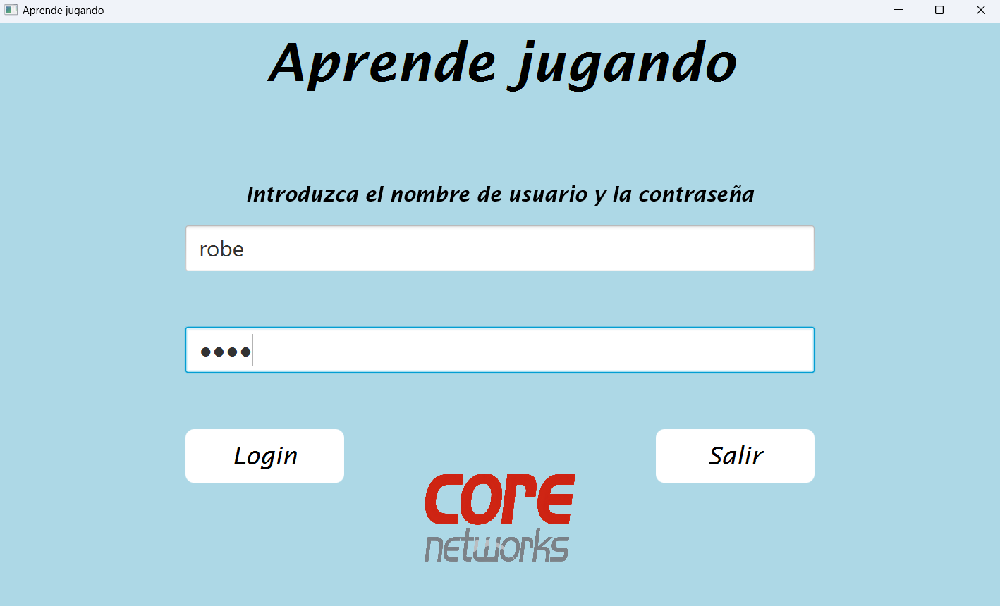
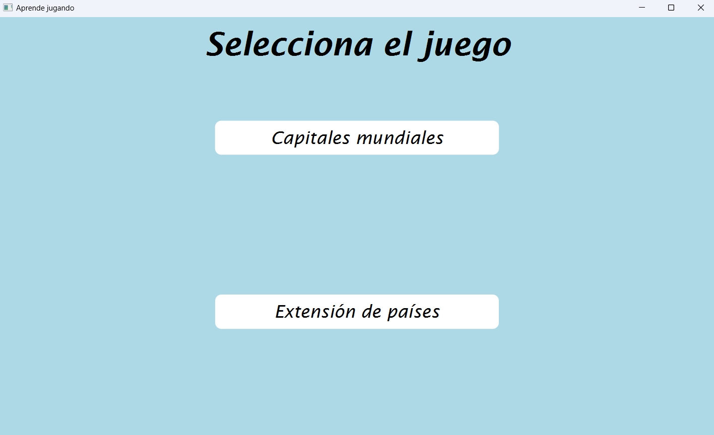
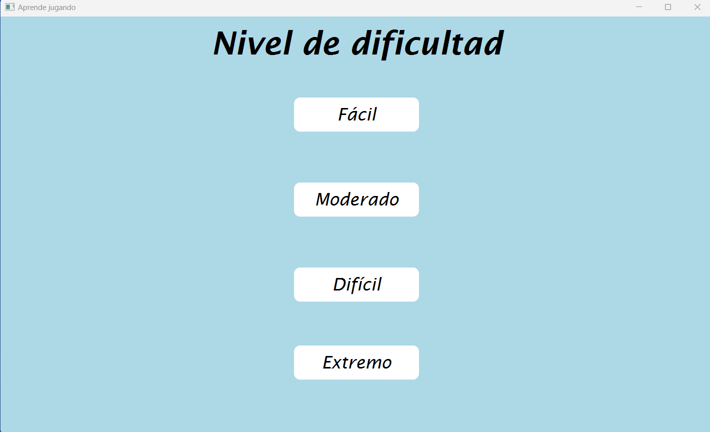
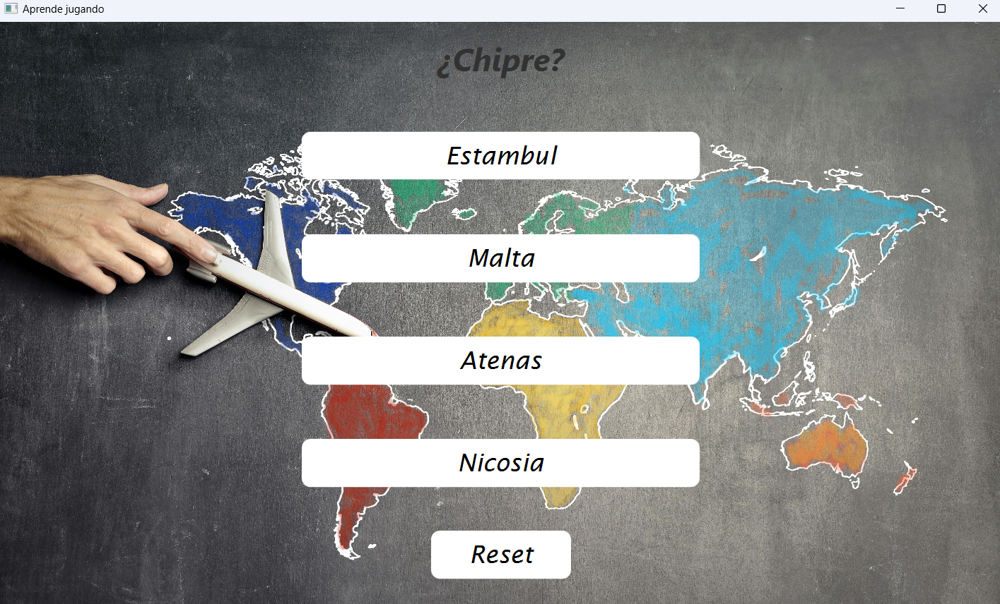
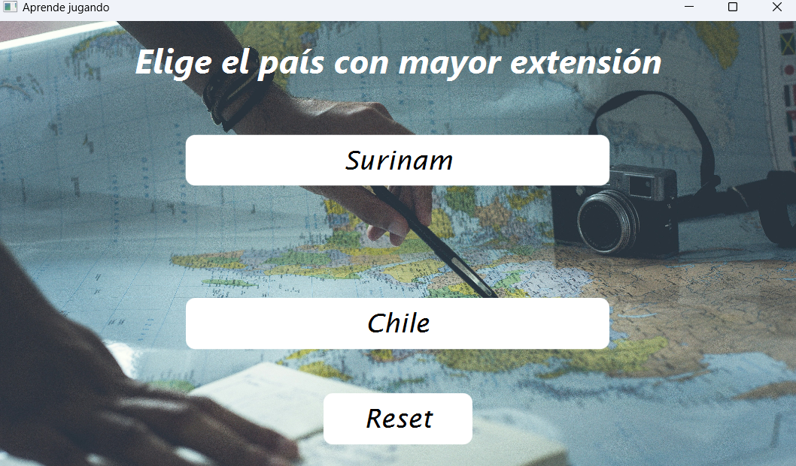
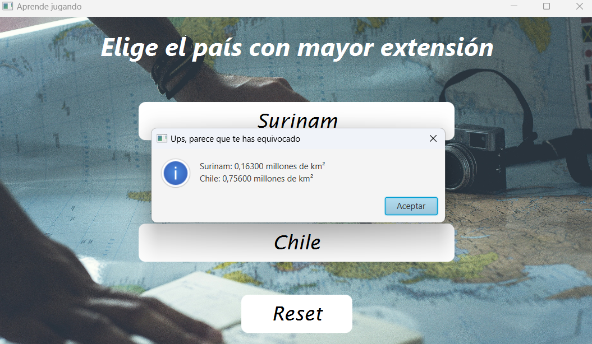
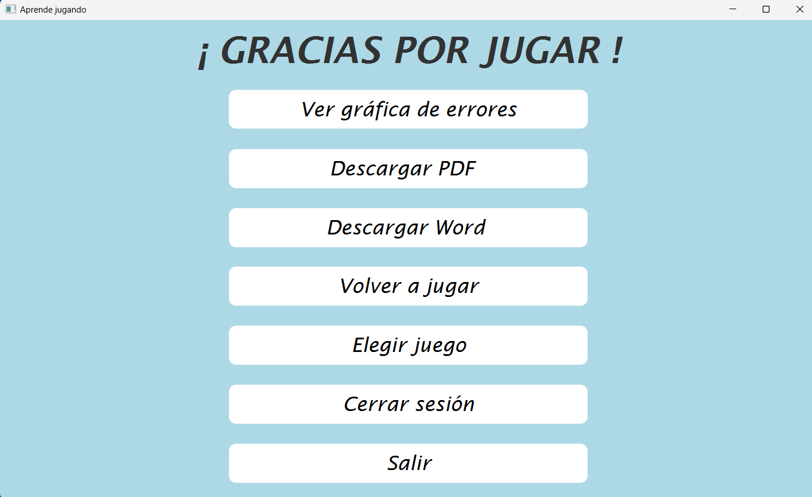
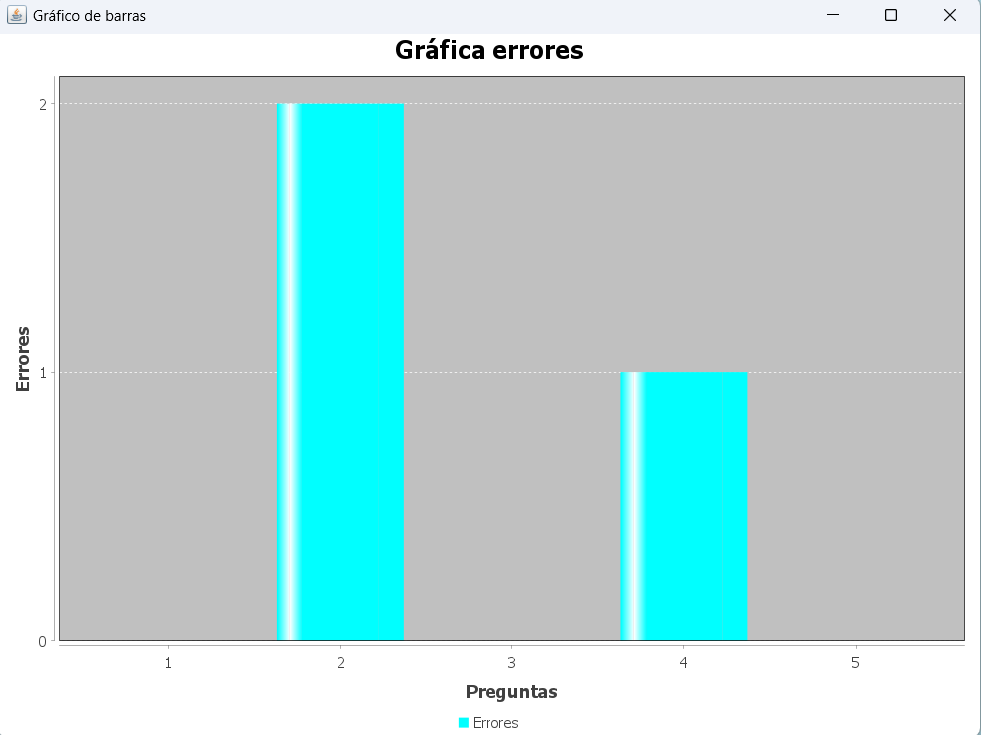
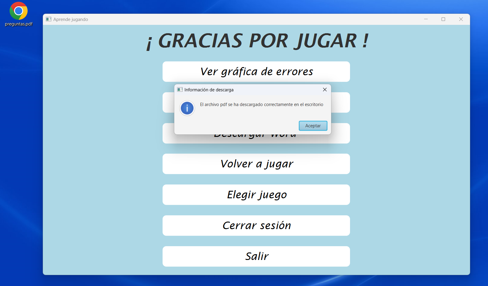

# PROYECTO FINAL PRIMERO

Proyecto creado para la asignatura de programación del primer curso de DAM. El proyecto es de temática libre pero tiene que ser desarrollado como aplicación de escritorio con JavaFX, también tenemos que apoyarnos en el software SceneBuilder para crear las distintas vistas.

## Requisitos

* Crea una aplicación de escritorio con JavaFX usando Maven.
* La aplicación debe de generar un archivo Word.
* La aplicación debe de generar un PDF.
* Debemos de incluir la dependencia JUnit y realiar algún test.
* Utilización de JFreeChart para generar alguna gráfica.

## Idea principal

Lo primero que hice fue en pensar una temática que me permitiera implementar todos los requisitos de forma lógica, no quería hacer una mezcla de cosas sin sentido.
Decidí crear un juego de preguntas sobre capitales mundiales, nos preguntarían por un país y se nos mostrarían 4 opciones de las cuales una era la correcta.

Al finalizar la partida contestando un número determinado de preguntas nos aparecería una pantalla final con las siguientes opciones: 
1. Ver gráfica de errores (JFreeChart).
2. Descargar PDF (Apache pdfbox).
3. Descargar Word (Apache poi).
4. Volver a Jugar.
5. Salir.

   >[NOTA]
   >
   >Posteriormente, se incluirían dos opciones más: elegir juego y cerrar sesión.

## Desarrollo
Empezamos creando el proyecto Maven, diseñando las vistas en SceneBuilder y consiguiendo que podamos navegar entre las distintas escenas de la aplicación.
Las dependencias las voy agregando una a una según las necesito y asegurandome de que todo va funcionando y de que no hay ningún tipo de conflicto entre las dependencias.
Todo el proyecto se ha diseñado simulando el MVC. Aún no hemos visto este patrón de diseño en clase pero lo he intentado simular con la información que he recopilado de distintas fuentes en Internet.

1. Como aún no hemos visto conexión con base de datos, las preguntas las he tenido que guardar en un archivo de clase. Para solucionar esto lo que pensé fue lo siguiente:
   
  * Crear una clase Pregunta con las siguientes propiedades:
     * Número de pregunta (autoincremento).
     * Pregunta.
     * Respuesta correcta.
     * Respuesta incorrecta A.
     * Respuesta incorrecta B.
     * Respuesta incorrecta C.
     * Lista de respuestas.
       
  * Crear el constructor indicando que el orden en el que incluiría la información sería el mismo en el que están definidas las propiedades.
     * El primer String sería la pregunta, el segundo la respuesta correcta y el resto las incorrectas.
     * El propio constructor, agregaría las 4 propiedades de respuesta a la propiedad lista de respuestas y después se encargaría de desordenar la lista, de esa manera, cuando ofrezcamos las respuestas al formular la pregunta el orden en el que aparecen sería completamente aleatorio. Si no hubiera hecho esto, siempre la primera respuesta habría sido la correcta.

  * Crear una clase Preguntas en las que crearíamos a mano las preguntas que queríamos incluir en el juego.

2. Cada dependencia que vamos a utilizar (PDF,Word,etc) debía tener su propia clase. Esto lo hago para intentar seguir el princpio SRP. De esta manera, si quisiera realizar en el futuro alguna modificación en el Word, tendría clara la clase que hay que modificar y no afectaría a ninguna otra.

3. Inlcuir un archivo CSS básico para poder modificar la apariencia de las ventanas. También incluir distintas ventanas emergentes a lo largo del programa.

4. Para elegir la cantidad de preguntas incluí una vista en el que se seleccionaba el nivel de dificulad:
   * Fácil -> 3 preguntas.
   * Moderado -> 5 preguntas.
   * Difícil -> 10 preguntas.
   * Extremo -> Todos los paises incluidos.

     En los niveles fácil, moderado y difícil, si te equivocas, puedes volver a contestar. Simplemente ese intento fallado se verá reflejado en la gráfica.
     
     En el nivel extremo si tienes un único fallo la partida termina. (Los compañeros de clase jugaron bastante para ver quien conseguía el record).
   
6. Decidí incluir un login de usuario al principio del juego. Nuevamente al no tener conocimiento para realizar la conexión con la base de datos me ví obligado a darle una solución similar a las preguntas.

   * Crear clase Usuario.
   * Crear clase Usuarios.
   * Crear e incluir la vista del login de usuario.

7. Como  el proyecto lo termine con bastante tiempo de antelación con respecto a la fecha de entra, incluí otro juego. Para que tuviera relazión con el juego anterior decidí crear un juego donde te daban dos países y tenías que decidir cuál tenía una mayor extensión.

8. Crear e incluir una vista para seleccionar el juego que queremos agregar.

## Conclusión
Crear este proyecto me ha ayudado mucho a mejorar, sobre todo a enfrentarme a algo que desconozco por completo y de forma autónoma ser capaz de cumplir con lo necesario.

## Multimedia
Adjunto algunas capturas de pantallas de la aplicación para que pueda verse el resultado final.

